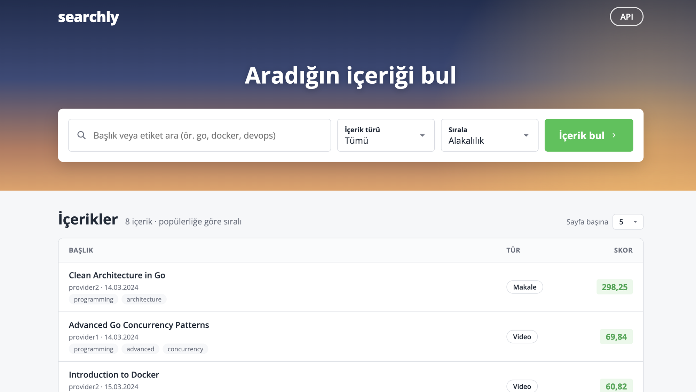
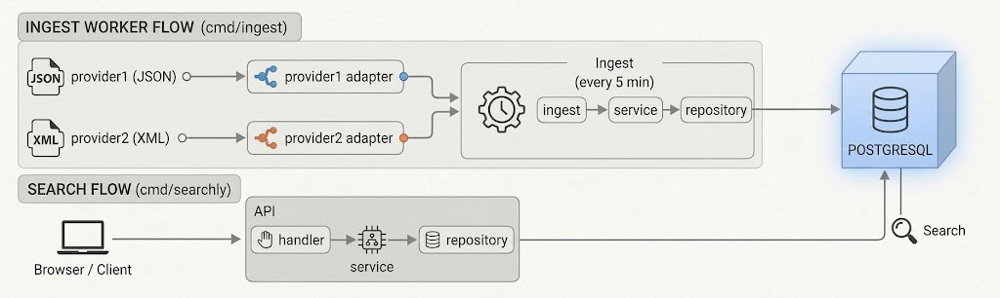

# Searchly

Searchly is a search service for videos and articles. It gets content from different providers and changes it into one common format. Then it gives each item a score. When you search, it returns the best results in order. It also has a simple web dashboard and interactive API docs.



## Setup and running

Requirement: Docker.

```sh
docker compose up -d --build
```

This command starts PostgreSQL and runs the migrations. Then it starts the ingest worker and the API. The ingest worker gets data from the providers right away. After that, it does this again every 5 minutes.

| | Address |
|---|---|
| Dashboard | http://localhost:8080 |
| API docs | http://localhost:8080/docs |
| Search API | http://localhost:8080/api/v1/contents?q=go |
| Health check | http://localhost:8080/health |

To stop, run `docker compose down`. To stop and also delete the data, run `docker compose down -v`. To run more than one ingest worker, run `docker compose up -d --build --scale ingest=3`.

Settings come from environment variables. Every setting has a default value, so the app works without a `.env` file. To change a setting, copy `.env.example` to `.env` and edit it.

### Local development

Requirements: Go 1.26 and Docker (only for PostgreSQL).

```sh
make db-up             # start PostgreSQL (localhost:5432)
make migrate           # run the migrations
make ingest            # get data from the providers once and save it
make run               # API + dashboard (localhost:8080)
make ingest-worker     # run ingest every 5 minutes
make test              # unit tests, no database needed
make test-integration  # also runs the tests that need PostgreSQL
```

### Tests

Integration tests do not touch the development database. They create a separate `searchly_test` database on the same server. Before each test, they build the schema again from the migrations. To use a different PostgreSQL, set `DATABASE_URL`.

## API docs

The API is documented with OpenAPI 3. The spec is in [`api/openapi.yaml`](api/openapi.yaml). When the app is running, you can see and try all endpoints, parameters, response schemas and examples in Swagger UI: http://localhost:8080/docs

## Technology choices

| Choice | Reason |
|---|---|
| **Go** | One binary, fast startup and low memory use. The standard library is enough for concurrent work like the ingest worker and the HTTP server. Static types make it safer to convert the provider formats. |
| **Fiber v3** | I use this framework every day. The `requestid` middleware gives each request a unique ID, so it is easy to follow a request in the logs. The `recover` middleware keeps the server running if a handler panics. The central error handler turns unknown routes and unexpected errors into the standard error format. |
| **PostgreSQL** | This is the database I use most and know best. It has built-in full-text search (`tsvector`, `ts_rank`, GIN index), so there is no need for a separate search engine. For data consistency, it has ACID transactions, `ON CONFLICT` upserts, enums and CHECK constraints. Multiple ingest workers also share the providers through PostgreSQL (`FOR UPDATE SKIP LOCKED`), so there is no need for a separate queue system. |
| **pgx (no ORM)** | The search query uses full-text search, `ts_rank` and a score calculated at query time. With an ORM, these would become raw SQL anyway. Writing SQL directly makes it clear what runs. User input is always sent as a parameter. |
| **goose (migrations)** | It keeps track of the applied migrations in the database and runs only the missing ones. So it is safe to run again, and no data is lost. It uses an advisory lock, so only one process can run migrations at a time. |
| **ozzo-validation** | It makes validation rules easier to read and helps avoid repeated code. |
| **golang.org/x/time/rate** | Token bucket rate limit for each provider. It is standard and safe for concurrent use. |
| **log/slog** | Structured JSON logs from the standard library. No extra dependency. |
| **Vanilla JS dashboard** | The dashboard only needs to be simple. I did not want to add a build step or a Node dependency for the person running the project. The files are embedded in the binary and served from the same port. |

## Architecture



The data flow is split into two separate processes:

- The **ingest worker** gets data from the providers, converts it to the standard model, scores it and writes it to the database.
- The **API** only reads from the database. A user request never goes to a provider. So if a provider is slow or down, search still works with the last good data.

### Packages

| Package | Responsibility |
|---|---|
| `cmd/searchly` | API server: sets up dependencies and handles graceful shutdown |
| `cmd/ingest` | Ingest: runs once, or again and again with `-interval` |
| `cmd/migrate` | Runs the pending migrations |
| `migrations` | SQL migration files (embedded in the binary) |
| `api` | OpenAPI spec and the Swagger UI page (embedded in the binary) |
| `internal/model` | Provider-independent `Content` model, validation and score calculation |
| `internal/provider/httpclient` | Shared HTTP for providers: rate limit, timeout, retry |
| `internal/provider/paging` | Rules for going through pages and when to stop |
| `internal/provider/provider1`, `provider2` | Provider adapters: request, decode, convert to `model.Content` |
| `internal/ingest` | Processes the providers. If one fails, the others continue. In worker mode, it shares the providers with other workers through `provider_sync`. |
| `internal/service` | Business rules: validation before writing, pagination |
| `internal/repository` | PostgreSQL access: upsert, search, score and relevance queries |
| `internal/handler` | HTTP handlers, parameter validation, one error format |
| `internal/server` | Fiber app, routes, middleware (request ID, logging, panic recovery) |
| `internal/dashboard` | Web UI (HTML + vanilla JS, embedded in the binary) |
| `internal/database` | Creating the DB connection pool and running migrations |
| `internal/config` | Environment variables and `.env` |

## Design decisions

- **Score:** The formula in the case has a fixed part: `(base score × content type multiplier) + engagement score`. This part is calculated during ingest and saved in the `base_score` column. The freshness score changes over time, even when the data does not change. So it is not saved. It is added in SQL at search time, based on the age of the content. This way the score is never out of date, and no scheduled job is needed.
- **Dates are stored by day:** provider1 gives dates with seconds (`2024-03-15T10:00:00Z`). provider2 gives only the day (`2024-03-15`). To treat both providers the same in the freshness score, all dates are cut to the day in UTC.
- **Search:** Search uses PostgreSQL full-text search on titles and tags. Every word matches as a prefix ("concur" → "concurrency"), so the user sees results while typing. In relevance order, a full word match is worth more than a prefix match. A match in the title is worth more than a match in the tags. Only letters and numbers are taken from the user input, and the query is always sent as a parameter.
- **Provider integration:** Each provider has its own adapter package. The adapter converts the provider's JSON or XML format to the standard `model.Content`. To add a new provider, write a new adapter and add one line to `cmd/ingest`. Each provider has its own rate limiter (token bucket, 2 requests per second by default). Each request has a 5 second timeout. On network errors, 5xx and 429, the client retries up to 3 times with a growing wait time. On 429, it follows the `Retry-After` header.
- **Error isolation:** If one provider fails, the others still run, and the old data of the failed provider stays in the database. An invalid record is skipped and logged. The other records in the same response are still saved.
- **Data consistency:** `(provider, provider_id)` is unique. The data of each provider is written in one transaction with `INSERT ... ON CONFLICT DO UPDATE`. So running it again does not create duplicate records. Records are validated in Go before they are saved. The database also protects them with enums and CHECK constraints.
- **Multiple ingest workers:** Workers share the providers through the `provider_sync` table. When a provider is due, one worker takes it for a limited time with `FOR UPDATE SKIP LOCKED`. More workers do not make ingest run more often. They add capacity. If a worker crashes, another worker takes the provider when the time runs out.

## Notes

### Cache

The data is small today, so there is no cache yet. This is a design that can be added when traffic grows:

**What to cache:** The search responses for users. Not the provider requests, because ingest already makes them on a schedule. Today each search goes to the database as a full-text search, a count query and a score calculation.

**Why it fits:** The data **only changes during ingest**. Between two ingest runs, the same search always gives the same result.

**Why Redis (not in-memory):** The ingest worker and the API are separate processes. The ingest worker cannot reach an in-memory cache inside the API. So it cannot clear the cache when new data is written, and the only option is to wait for the TTL. Redis is a shared place that both can reach. Multiple API instances can also share the same cache.

**Design:**

1. **Key:** `search:v{version}:{hash of the normalized parameters}`. The parameters are `q`, `type`, `sort`, `page` and `per_page`. The value is the JSON of the response page.
2. **Cache invalidation:** When ingest finishes successfully, the worker runs `INCR search:version`. New requests build keys with the new version, so the old entries are never read again. There is no need to scan or delete keys.
3. **TTL (for example 5 min):** Entries from old versions are removed automatically. When the freshness score changes at midnight, the cache is late by at most the TTL.
4. **Fail-open:** If Redis is not reachable, the cache is skipped. The request goes straight to the database, and a warning is logged. The cache is never the single source of truth.

### Metrics

There are no metrics yet, because I did not want the person running the project to also install Prometheus. Today there are three ways to monitor the service: structured JSON logs (request ID, duration and status for each request, and provider, record count and duration for each ingest run), the `last_success_at` and `last_error` values in the `provider_sync` table, and the `/health` endpoint. This is a design that can be added in a real environment:

- **How:** With `prometheus/client_golang`. The API adds a `/metrics` endpoint on its current port. The ingest worker has no HTTP server, so it serves only `/metrics` on a small separate port.
- **API:** Request count and a latency histogram by route and status code (`http_requests_total`, `http_request_duration_seconds`), added with one Fiber middleware. Also, how full the database connection pool is (`pgxpool.Stat()`).
- **Ingest:** Run duration for each provider, the number of saved and skipped records, and the number of failed runs. Also, the number of provider requests by status code and the number of retries, added inside `httpclient`.
- **Most useful metric for alerts:** The time since the last successful run of each provider. `provider_sync.last_success_at` already stores this, so it can be exposed as a gauge. If the value grows past a few ingest intervals, the data of that provider is getting old.
